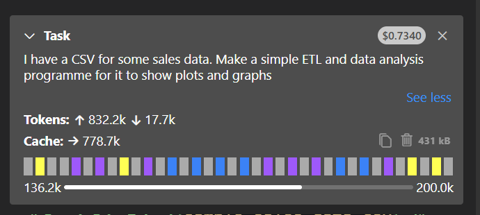

# Cline Demo

CLAUDE: 

create a simple sales csv with just 5 rows

sales_data = [
    ['Date', 'Product', 'Quantity', 'Unit_Price', 'Total'],
    ['2024-01-15', 'Laptop', 2, 999.99, 1999.98],
    ['2024-01-16', 'Mouse', 5, 29.99, 149.95],
    ['2024-01-17', 'Keyboard', 3, 79.99, 239.97],
    ['2024-01-18', 'Monitor', 1, 299.99, 299.99],
    ['2024-01-19', 'Headphones', 4, 149.99, 599.96]
]

CLINE:

“I have a CSV for some sales data. Make a simple ETL and data analysis programme for it to show plots and graphs. There is already a folder called `sales_etl_analysis` - please use `earl_demo` as folder name”
sales_data = [
    ['Date', 'Product', 'Quantity', 'Unit_Price', 'Total'],
    ['2024-01-15', 'Laptop', 2, 999.99, 1999.98],
    ['2024-01-16', 'Mouse', 5, 29.99, 149.95],
    ['2024-01-17', 'Keyboard', 3, 79.99, 239.97],
    ['2024-01-18', 'Monitor', 1, 299.99, 299.99],
    ['2024-01-19', 'Headphones', 4, 149.99, 599.96]
]

COST: 

It cost $0.75 and output is in repo `sales_etl_analysis` along with `healthcare_noshows_pipeline'