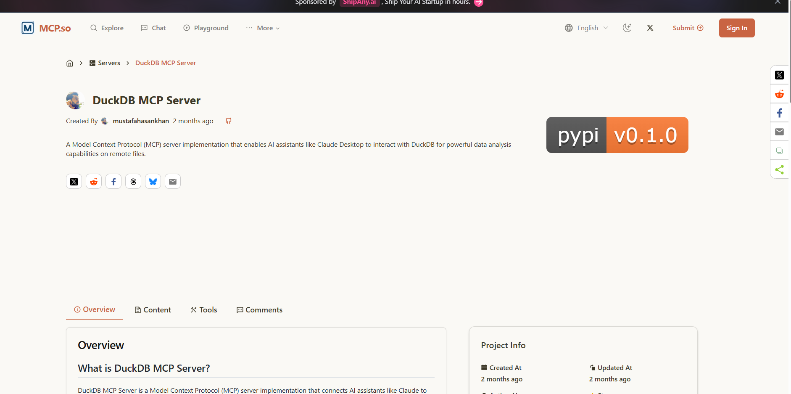
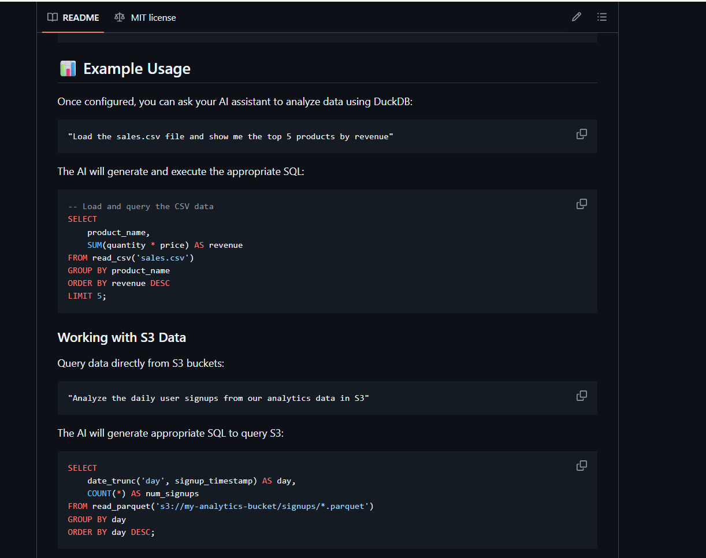

# Model Context Protocal (MCP)

As humans, we often do the following:

Search or get a list of all available tools.
- Select the best tool.
- Get the details of how to implement it.
- Implement it and get a result.

How does an AI Agent do this (discovery and implementation)?

This is the basis of the Model Context Protocal.

Think HTTP protocol for example.

Thus in time, our apps may well be a collection of AI Agents that use 3rd party tools that are speicalist and highly developed, in the same way we use deterministically, Numpy, Pandas etc.


I got this from [mcp.so](https://mcp.so/server/duckdb-mcp-server/mustafahasankhan)



https://github.com/mustafahasankhan/duckdb-mcp-server


We load this config in the appropriate place for your host:

```
{
  "mcpServers": {
    "duckdb": {
      "command": "duckdb-mcp-server",
      "args": [
        "--db-path",
        "~/claude-duckdb/data.db"
      ]
    }
  }
}
```



This enables the app to spin up the server locally in a separate process, run the tool and then shut down.

There is MCP Client code that the app includes to do this.

With modern abtractions, it is just a few lines of code.

Your AI Agent knows about this MCP Server, it can get a list of tools and as we saw in the ROUTER example, it can decide which tool to use as well as how to use.

*Discoverability and useability* of other AI Agent tools by our own agent.


## Agent 2 Agent (A2A)

Very new...

Google's proposal that complements MCP.

Agents can talk to other Agents.
