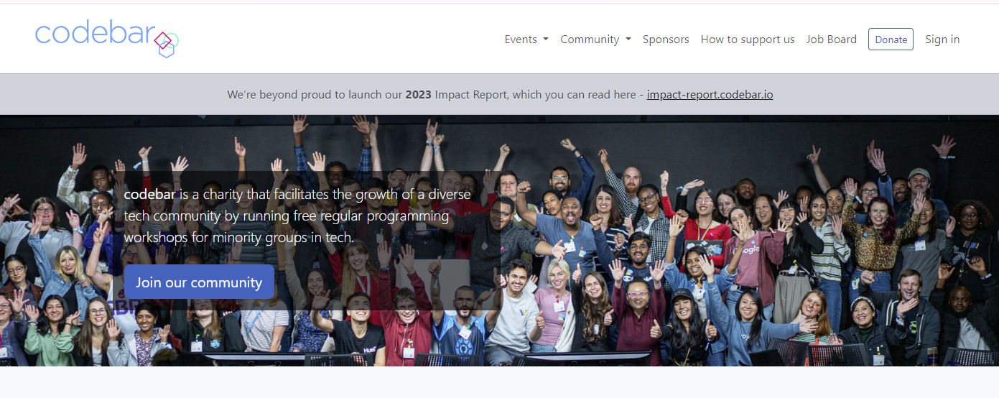
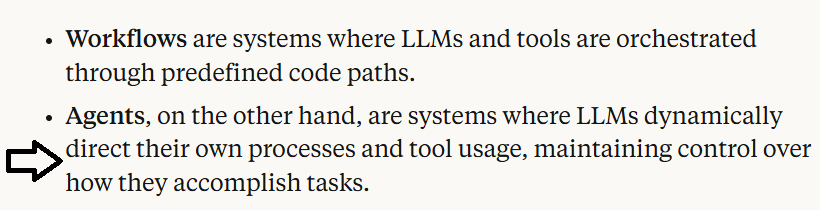
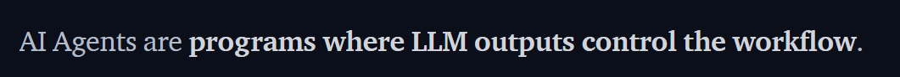
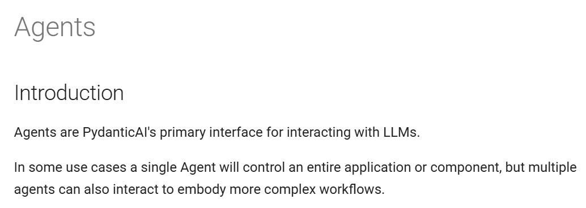
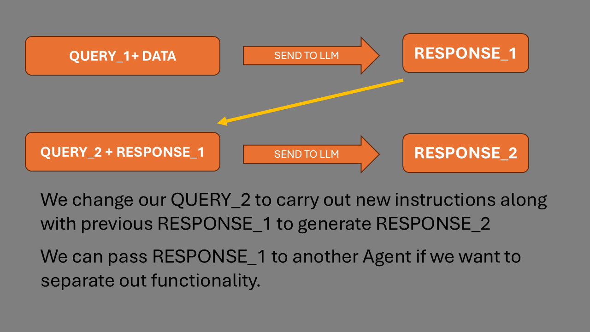
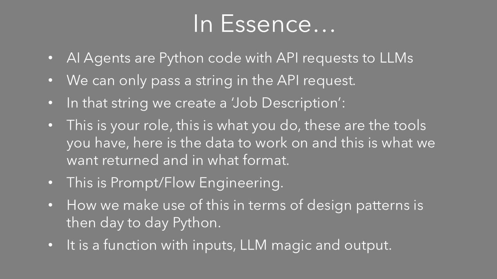
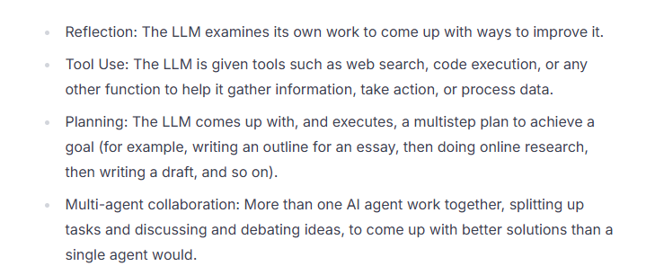
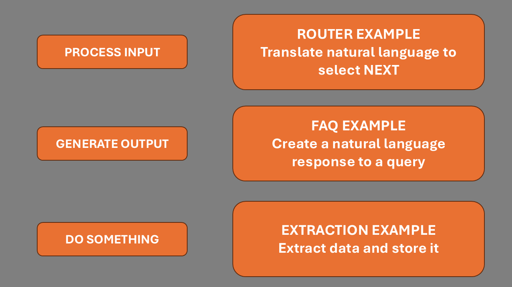
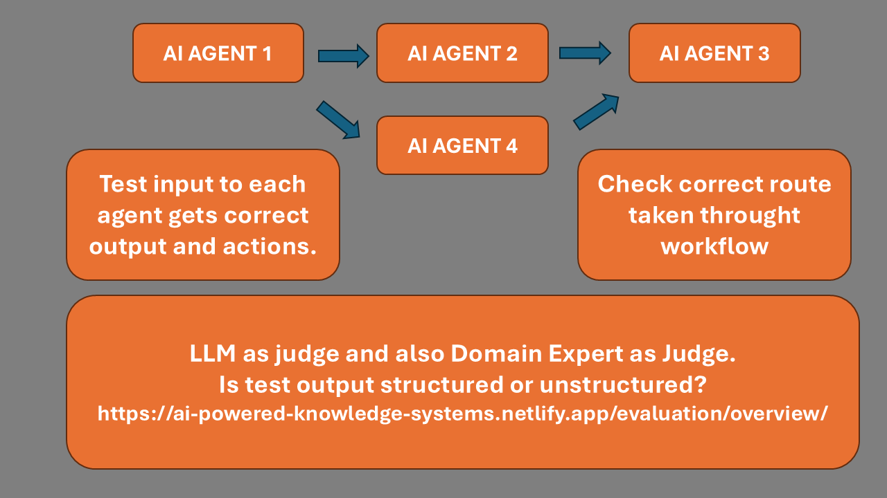
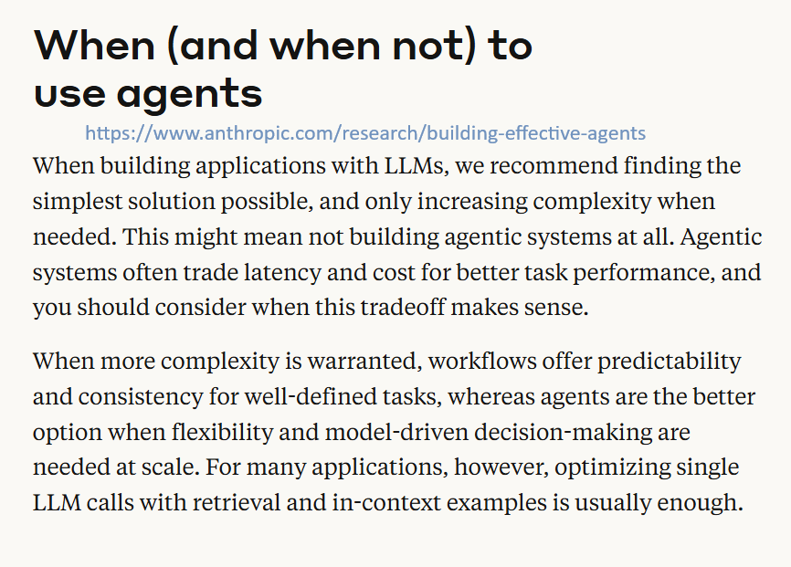

<!-- https://mconverter.eu/convert/markdown/html/ -->


The repo containing all the materials is here:

[https://pytest-cookbook.com/](https://pytest-cookbook.com/) (has link)

or

[https://github.com/Python-Test-Engineer/pydata-southampton](https://github.com/Python-Test-Engineer/pydata-southampton) (direct)

All links used are in LINKS.md

I will show you the repo and this is a mini-workshop effectively that can also be used for future reference.

And I will be using NOTES_PYDATA.md/NOTES_PYDATA.html for this talk so you can follow along with me. There will repetition of some information between my NOTES and the NOTEBOOKS to clarify matters.

The talk will be mostly code walkthroughs with notebooks that have a lot of comments for completeness and clarification.

## Aim

1. To see that it can be just 'AI as API', albeit a very magical API.
2. To show that AI based apps need not be all AI or not at all, but we can have 'a bit of AI in our apps'.
3. To show that it is 'business as usual' as Pythonistas, using our experience and skills to create AI Apps.

*I will use the term Data Engineering to cover Data Science, Data Analysis and other ML tasks.*
<h3 style="color:#DB4C00;">
 Let's look at where Agentic Data Engineering differ from regular Data Engineering perhaps we may see that AI Agents are everyday Python with LLM API calls.
</h3>

## Who am I?

**I am one of *US* - a regular Pythonista.**

Wrestling and getting to grips with these new technologies.

*"It doesn't get any easier - just different." - Anon*

I was in tech in the early 2000s as a Business Information Architect and Certified MicroSoft SQL Server DBA. I returned in 2017 via WordPress and JavaScript Frameworks, moving to Python and ML in 2021.

Currently, I am working on a project 'AI Powered Knowledge Systems', building a book/framework similiar to PyTest Full Stack.

My links:

- <https://ai-powered-knowledge-systems.netlify.app/>
- <https://pytest-cookbook.com/>
- <https://django-fullstack-testing.netlify.app/>

### Brighton, UK


### Volunteer coach

I am a volunteer coach at codebar.io/brighton



and I also enjoy working in community kitchens and partner dancing.
<br><br><br><br>

### Leo

Just got a Red Fox Labrador Pup Leo, (much earlier than planned):


We have a local red fox that is apt to follow us...


...even to our home...


### My first computer 1979

!

<https://en.wikipedia.org/wiki/Punched_tape#/media/File:Creed_model_6S-2_paper_tape_reader.jpg>

...cut and paste was cut and paste!


# What are AI Agents?

There are many definitions:

## Anthropic



Very good article [https://www.anthropic.com/research/building-effective-agents](https://www.anthropic.com/research/building-effective-agents)

## HuggingFace



## Pydantic



We will look at examples of code to see what AI Agents are and what they can do.

If we look at:

## [https://aiagentsdirectory.com/landscape](https://aiagentsdirectory.com/landscape)

We can see that there are many examples of AI Agent Frameworks and they seem to increase each week.

At the beginning of the year it was in the 700s.

## Demystify and simplify

What I would like to achieve in this talk is to **demystify** and **simplify** AI Agents and AI Programming because it can seem like it is another different world of dev.

What if AI Agents were 'just' Python code with a REST API call, admittedly a very magical API?

*AI (Agents) as API*...

Then, we would use day to day Python design patterns to handle the responses we get back from the AI Agent and move on to the next step.

Business as usual for Python developers.

This is the main focus of the talk - **demystify and simplify** - and this will enable you to create AI Agents and also construct workflows using AI Agents.

With that in mind, we don't need to fully grasp the python code this time around but focus on the 'AI bit' which I will highlight.

It is more about seeing the high level view and one can dig deeper into the code offline.

The repo is built as if a mini workshop with notebooks and `.py` files heavily commented.

*Look at the patterns and structure rather than the code details* - it is what helped me get to grips with this new paradigm.

We will use Notebooks to explore AI Agents and then we will see an implementation of an AI Agent in a py file that combines many of the concepts we will discuss.

## 180 degrees


I like to use the metaphor of the upside down computer mouse. When we try to use it, it can take while to reverse our apporach. It is still the same set of movements - left, right, up and down - but in the opposite way to the way we are used to.

There are 3 areas concerning Agentic AI in my opinion:

1. Client side creation of endpoints (APIs) rather than server side prebuilt endpoints.
2. Use of Natural/Human Language, in my case English to create the code.
3. Autonomy - the LLM directs the flow of the app.

For the purpose of this talk I will use the term `function` in the mathematical sense:

### input -> function(input) -> output -> function(output) -> output2

The function might be a variation on the Agent we are using or it may be another Agent that accepts the opuput as input. No different to Python Classes/Functions in an App.



The `function` might be a Python function or a class.

## 3rd Party Agents and Tools

[https://aiagentsdirectory.com/allstats](https://aiagentsdirectory.com/allstats) shows the number of growing Agents available as stand alone Agentic systems.

However, two new protocols have emerged this year: Model Context Protocol, (MCP), and Agent 2 Agent, (A2A).

If we think of our mobile phone, we have a number of apps installed. For a particular app, we can add 'extensions' to increase its capabilities. MCP is the protocol that enables discoverability and implementation of 3rd party TOOLS for our app, (Agent), to use.

A2A is the protocol that enables discoverability and implementation of 3rd party AGENTS for our app, (Agent), to use.

With this in mind, we can see a future where we will be using many 3rd party Tools and Agents as we might use APIs.

Before we go into some code examples, we will refresh ourselves that a REST API a request is sending a payload of data to a server and then the server returns a response.

This is a very simple example of a REST API.

Again, this is to demystify and simplify any libraries we may import for convenience functions.

Authentication takes place by passing some sort of token to the server, usually in the headers:

```
model = "gpt-3.5-turbo"
model_endpoint = "https://api.openai.com/v1/chat/completions"

## There is no reference to previous requests to maintain a history - we must supply the history with each request.

headers = {
    "Content-Type": "application/json",
    "Authorization": f"Bearer {api_key}",
}

# payload may vary from LLM Organisation but it is a text string.
payload = {
   "model": model,
   "messages": [
       {"role": "system", "content": system_prompt},
       {"role": "user", "content": user_prompt},
   ],
   "stream": False,
   "temperature": temperature, 
}

Low Temperature:
The bag is full of mostly blue marbles, with a few red and green. Low temperature means you're very likely to pull a blue marble, but you might occasionally get a red or green.

High Temperature:
The bag is filled with a mix of colors, and all colors are equally likely. High temperature means you're equally likely to pull any color, including the less common ones.
# Use HTTP POST method
response = requests.post(
   url=model_endpoinLow Temperature:
The bag is full of mostly blue marbles, with a few red and green. Low temperature means you're very likely to pull a blue marble, but you might occasionally get a red or green.
High Temperature:
The bag is filled with a mix of colors, and all colors are equally likely. High temperature means you're equally likely to pull any color, including the less common ones.t, # The API
   headers=headers, # Headers for authentication etc
   data=json.dumps(payload) # The request data we are sending
).json()

# KEY TAKEAWAYs

## There is only one endpoint. We don't use other endpoints for differing tasks, there is just one end point and we will create our custom endpoint through prompt engineering.

```

The request is text and does not contain any objects or other data types.

Likewise, we get a text response. We pass some text to a function and get some text back.

(Current models are 'Imperative' in that we say what they are, what they do, how they do it...New REASONING models are 'Declarative' in that we say what we want them to do - the goal - what we want as output and what we might not want. The model then 'reasons' its way through the task.)

We can think of it as pseudo-code which we may write whilst developing an app.

In fact, it is like a person starting a new job. They will get a handbook of what the job involves, how to do it etc. and this is what we are doing with the LLM. 



Let's go to the notebooks and see some code examples.

# 4 main patterns

Andrew Ng describes four main patterns

<https://www.deeplearning.ai/the-batch/how-agents-can-improve-llm-performance/>



We have seen examples of these in this talk, bar a multi-agent pattern.

## REFLECTION PATTERN


input -> function(input) -> output -> function(output) -> output2

We generate a response with our first query using a system prompt to create code.

We then pass the output into another function that acts as a reviewer to produce the next version of the code.

## TOOLS

We have seen Tool Calling previously.

## PLANNING

We have seen planning previously.

# When might we use LLMs/Agents?



## MULTI AGENT

### Libraries

I like to think of Libraries as frameworks without the framework! By this I mean we get building blocks to help us build things without having to conform to a building plan.

#### Pydantic AI

Pydantic is well known in everyday Python and is used by most AI Agent frameworks as structured data validation is vital.

PydanticAI is a library/framework that uses Pydantic to create AI Agents.

#### Huggingface SmolAgents

HF SmolAgents is a library/framework that uses Huggingface Transformers to create AI Agents. It has broken new ground throught the use of its CodeAgent where tool calling is done via Python rather than JSON...show images...

### Crews/Swarms

Crews and Swarms are design patterns for MultiAgent collaboration. They each have their own use cases and we saw earlier that AI Agents can emit the 'next' step in the app which a range of desing patterns can harness.

- <https://aiagentsdirectory.com/category/ai-agents-frameworks>

## Frameworks

There are many frameworks and libraries that can be used to create AI Agents. Some are more focused on the AI Agent and some are more focused on the UI.

LlamaIndex
Langchain
Langraph
AutoGen
CrewAI

And there are many low/no code versions as we saw in the [AI Agents Directory](https://aiagentsdirectory.com/category/ai-agents-frameworks)

# Testing and Evaluation

We need a set of Ground Truths for various inputs for our workflow as well as a set of Ground Truths for tools and other functions used within an agent.

Similar principles to regular testing but if the outputs are unstructured text then we need to find a way to verify accuracy. LLM as Judge or Human Evaluation can be used.

The ROUTER example can be tested to see if the right report is selected for a set of Ground Truths.

The FAQ example can be tested to see if answers to questions are correct.



## <https://ai-powered-knowledge-systems.netlify.app/evaluation/overview/>

Useful article: [LLM as Judge](https://medium.com/towards-generative-ai/judgeit-automating-rag-evaluation-using-llm-as-a-judge-d7c10b3f2eeb)

## Summary

I hope AI Agents have been demystified and helped us understand what they can do, enabling us to either build our own frameworks or use existing ones, with a deeper appreciation and understanding of how they work.



Many talks on AI Agents stress using simple agents and introduce them bit by bit rather than create one large Agentic App.
