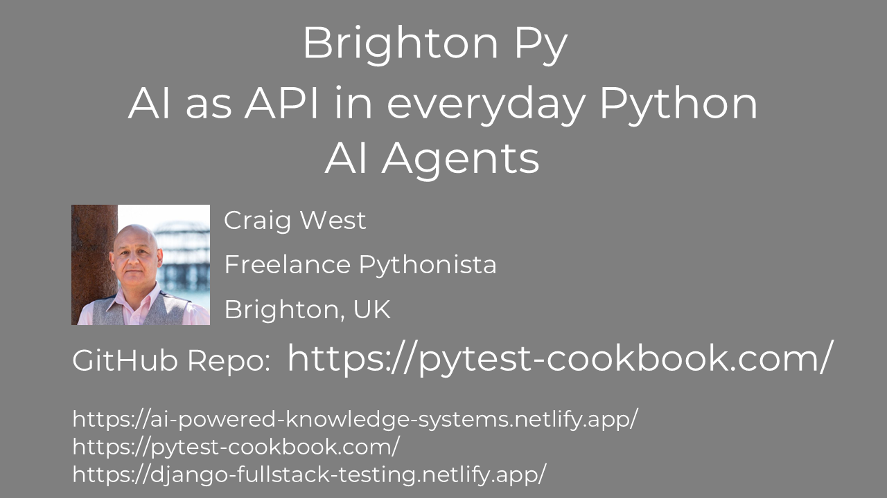
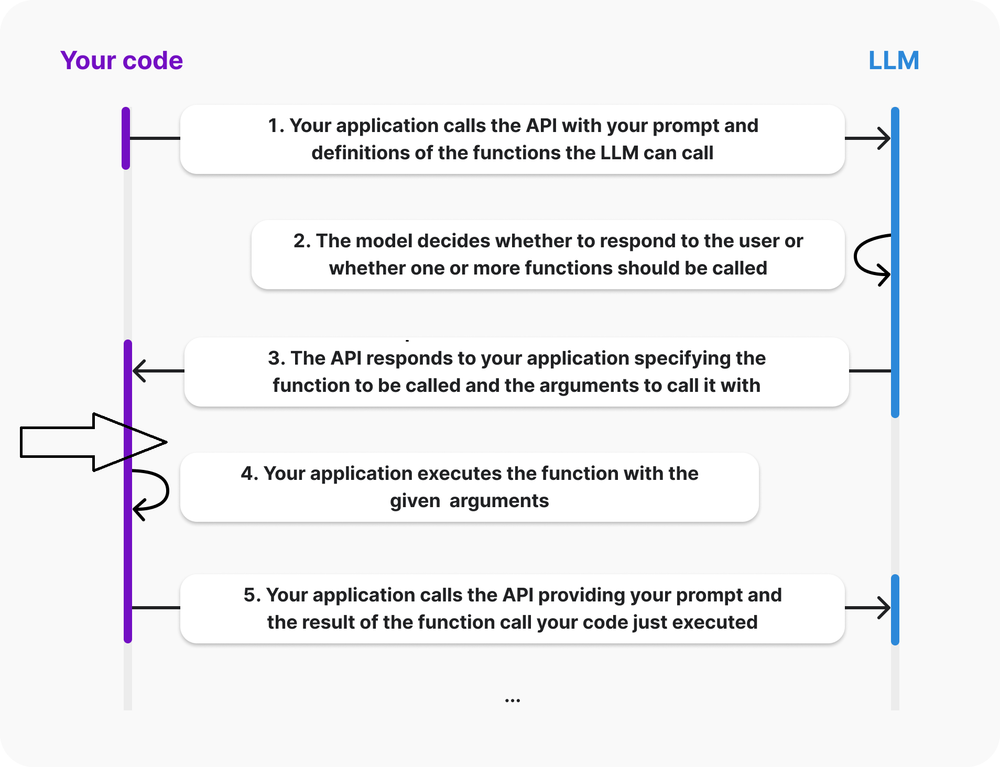

<!-- https://mconverter.eu/convert/markdown/html/ -->



The repo containing all the materials is here:

[https://pytest-cookbook.com/](https://pytest-cookbook.com/) (has link)

or

[https://github.com/Python-Test-Engineer/django-con-eu](https://github.com/Python-Test-Engineer/django-con-eu) (direct)

All links used are in LINKS.md

I will show you the repo and this is a mini-workshop effectively that can also be used for future reference.

And I will be using NOTES.md/NOTES.html for this talk so you can follow along with me. There will repetition of some information between my NOTES and the NOTEBOOKS to clarify matters.

The talk will be mostly code walkthroughs with notebooks that have a lot of comments for completeness and clarification.

## Aim

1. To see that it can be just 'AI as API', albeit a very magical API.
2. To show that AI based apps need not be all AI or not at all, but we can have 'a bit of AI in our apps'.
3. To show that it is 'business as usual' as Pythonistas, using our experience and skills to create AI Apps.

The Django implementation is a matter of copying over the Python code we will be exploring in the notebooks and using its response as context for a view in this Django app.

After my introduction, I will demo a Django App that has taken content from the DjangoCon Europe 2025 website and created an AI Assistant chatbot that answers questions about the conference.

It is a very basic implemenation but will show how my aims for the workshop are fulfilled

<h3 style="color:#DB4C00;">
 Let's look at where Agentic Apps differ from regular apps and perhaps we may see that AI Agents are everyday Python with LLM API calls.
</h3>

## Who am I?

**I am one of *US* - a regular Pythonista.**

Wrestling and getting to grips with these new technologies.

*"It doesn't get any easier - just different." - Anon*

I was in tech in the early 2000s as a Business Information Architect and Certified MicroSoft SQL Server DBA. I returned in 2017 via WordPress and JavaScript Frameworks, moving to Python and ML in 2021.

Currently, I am working on a project 'AI Powered Knowledge Systems', building a book/framework similiar to PyTest Full Stack.

My links:

- <https://ai-powered-knowledge-systems.netlify.app/>
- <https://pytest-cookbook.com/>
- <https://django-fullstack-testing.netlify.app/>

### Brighton, UK


### Volunteer coach

I am a volunteer coach at codebar.io/brighton


and I also enjoy working in community kitchens and partner dancing.
<br><br><br><br>

### Leo

Just got a Red Fox Labrador Pup Leo, (much earlier than planned):


We have a local red fox that is apt to follow us...


### My first computer 1979

!

<https://en.wikipedia.org/wiki/Punched_tape#/media/File:Creed_model_6S-2_paper_tape_reader.jpg>

...cut and paste was cut and paste!

# Demo Django App

We will look at a demo Django app that uses AI Agents to call LLMs. It is a chatbot style but could be a text field in a form that has Natural Language.

I took information from the Conference website and used the code, ( a copy and paste), from `03_faq_ipynb` to provide a help chatbot...

"what is a sprint and when does it take place - also I am not an expert coder does that matter?"

# What are AI Agents?

There are many definitions:

## Anthropic


Very good article [https://www.anthropic.com/research/building-effective-agents](https://www.anthropic.com/research/building-effective-agents)

## HuggingFace


## Pydantic


We will look at examples of code to see what AI Agents are and what they can do.

If we look at:

## [https://aiagentsdirectory.com/landscape](https://aiagentsdirectory.com/landscape)

We can see that there are many examples of AI Agent Frameworks and they seem to increase each week.

At the beginning of the year it was in the 700s.

## Demystify and simplify

What I would like to achieve in this talk is to **demystify** and **simplify** AI Agents and AI Programming because it can seem like it is another different world of dev.

What if AI Agents were 'just' Python code with a REST API call, admittedly a very magical API?

*AI (Agents) as API*...

Then, we would use day to day Python design patterns to handle the responses we get back from the AI Agent and move on to the next step.

Business as usual for Python developers.

This is the main focus of the talk - **demystify and simplify** - and this will enable you to create AI Agents and also construct workflows using AI Agents.

With that in mind, we don't need to fully grasp the python code this time around but focus on the 'AI bit' which I will highlight.

It is more about seeing the high level view and one can dig deeper into the code offline.

The repo is built as if a mini workshop with notebooks and `.py` files heavily commented.

*Look at the patterns and structure rather than the code details* - it is what helped me get to grips with this new paradigm.

We will use Notebooks to explore AI Agents and then we will see an implementation of an AI Agent in a py file that combines many of the concepts we will discuss.

## 180 degrees


I like to use the metaphor of the upside down computer mouse. When we try to use it, it can take while to reverse our apporach. It is still the same set of movements - left, right, up and down - but in the opposite way to the way we are used to.

There are 3 areas concerning Agentic AI in my opinion:

1. Client side creation of endpoints (APIs) rather than server side prebuilt endpoints.
2. Use of Natural/Human Language, in my case English to create the code.
3. Autonomy - the LLM directs the flow of the app.

For the purpose of this talk I will use the term `function` in the mathematical sense:

### input -> function(input) -> output -> function(output) -> output2

The function might be a variation on the Agent we are using or it may be another Agent that accepts the opuput as input. No different to Python Classes/Functions in an App.


The `function` might be a Python function or a class.

Before we go into some code examples, we will refresh ourselves that a REST API a request is sending a payload of data to a server and then the server returns a response.

This is a very simple example of a REST API.

Again, this is to demystify and simplify any libraries we may import for convenience functions.

Authentication takes place by passing some sort of token to the server, usually in the headers:

```
model = "gpt-3.5-turbo"
model_endpoint = "https://api.openai.com/v1/chat/completions"

## There is no reference to previous requests to maintain a history - we must supply the history with each request.

headers = {
    "Content-Type": "application/json",
    "Authorization": f"Bearer {api_key}",
}

# payload may vary from LLM Organisation but it is a text string.
payload = {
   "model": model,
   "messages": [
       {"role": "system", "content": system_prompt},
       {"role": "user", "content": user_prompt},
   ],
   "stream": False,
   "temperature": temperature, 
}

Low Temperature:
The bag is full of mostly blue marbles, with a few red and green. Low temperature means you're very likely to pull a blue marble, but you might occasionally get a red or green.

High Temperature:
The bag is filled with a mix of colors, and all colors are equally likely. High temperature means you're equally likely to pull any color, including the less common ones.
# Use HTTP POST method
response = requests.post(
   url=model_endpoinLow Temperature:
The bag is full of mostly blue marbles, with a few red and green. Low temperature means you're very likely to pull a blue marble, but you might occasionally get a red or green.
High Temperature:
The bag is filled with a mix of colors, and all colors are equally likely. High temperature means you're equally likely to pull any color, including the less common ones.t, # The API
   headers=headers, # Headers for authentication etc
   data=json.dumps(payload) # The request data we are sending
).json()

# KEY TAKEAWAYs

## There is only one endpoint. We don't use other endpoints for differing tasks, there is just one end point and we will create our custom endpoint through prompt engineering.

```

The request is text and does not contain any objects or other data types.

Likewise, we get a text response. We pass some text to a function and get some text back.

We will look at `01_openai_api_with_requests.ipynb` to see an example of getting a response from the LLM.

`01_openai_api_with_requests.ipynb`.

In `02_api.ipynb`, we can see that we can get a joke from a regular API endpoint, with the assumption that there is no AI involved!

We can also ask OpenAI to tell us a joke...

What if we want a more complex API endpoint/route?

Let's say we want to get a joke, get a rating as well as a verdict on whether it is worthy of publishing or whether a HUMAN should make the joke for publishing.

We can do this by using a prompt.

The prompt is the input to the AI agent.

The prompt can be considered to be the API route we are creating and it it will be in Natural Language.

Let's look at this file `02_api.ipynb`...

We can see this in `02_api.ipynb` where we pass a system prompt and then a prompt to create this endpoint, specifying how we want the data returned.

This is effectively a new route for the API, but instead of it being coded on the server side by someone, it is coded on the client side, sent with the payload AND the code is NATURAL LANGUAGE.

In the early days of ChatGPT, *prompt engineering* was often shownd as hacks or tricks. Nowdays, it seems far more structured and different LLMs use different schemas.

(Current models are 'Imperative' in that we say what they are, what they do, how they do it...New REASONING models are 'Declarative' in that we say what we want them to do - the goal - what we want as output and what we might not want. The model then 'reasons' its way through the task.)

We can think of it as pseudo-code which we may write whilst developing an app.

In fact, it is like a person starting a new job. They will get a handbook of what the job involves, how to do it etc. and this is what we are doing with the LLM. `sample_prompt.md` is an example of this and how we could import content from a Markdown file.

We set the system prompt to guide the AI agent, and then the prompt to create the endpoint.

We can have more information than necessary and this can do no harm provide it is consistent and logical with the remaining prompt. Obviously, there will be more token usage but with the price going down, it is not an issue.

We have covered 2/3 of the AI reverse process - Client Side creation of the route and the use of Natural Language.

What about Autonomy?

In our output, we asked the LLM to give not just a rating but a verdict on whether it is worthy of publishing or not. This is the `next` parameter that is returned. This is our own creation and we can have any key name.

There are many software design patterns but essentially the next step in the app has been selected by the LLM. It is the `if/else` statement. or router.

In summary, this module has shown the 3 counter-intuitive steps of AI Agents - Autonomy, Client Side Creation of the route and the use of Natural Language.

# FAQ

Sometimes we might think that AI Development is binary - it is fully AI or not.

What if we can include 'a bit of AI' in our App? Remember, AI Agents are snippets of code that make a request and get a response.

If we have a Search, FAQ or Help section, we can leverage the power of the AI Agent to create a facility to process Natural Language. Getting information from a form, (excluding text fields), give us structured input data and one text field may be used for the query as natural language input to be resolved by the AI Agent.

Let's look at `03_faq.ipynb` for a simple example. (We will see this in our Django demo and it is a view receiving some text and processing it to give text back to the user via a view).

I am using Gradio as a UI for this example notebook and we can see that we have some data in the FAQ list.

Obviously, this can be more involved and use structured inputs from associated form fields, but for now lets assume that we have extracted the relevant information.

This highlights an important point that we don't need to use LLMs for Agents. If we can get structured data from a form, then it is more deterministic and better. LLMs are very useful for converting Natural Language inputs to structured data.

This is RAG or Retrieval Augmented Generation, where we 'augment' the query with the relevant data that the model was not trained on and then the LLM 'generates' the response based on the query, the data and the prompt. We tend to see RAG with vector databases and semantic search but RAG is essentially augmenting the LLM with our own data to 'train' it or 'fine tune'.

We can see that we can create a powerful AI Agent that can answer questions based on the data in the FAQ list.

# ROUTER

We can further extend this to be a type of ROUTER or *if/else* statement to provide a sense of autonomy to the app - it will direct the flow of the app. We can have 'Human in the Loop' at any stage so that we restrict the flow to approved paths.

 We know the overall workflow of the app but not how it goes from beginning to end. We no longer micro-manage the app but delegate steps to the AI Agent, very much like we might manage a team member - mciro-manage or use delegation.

In this example, we can let the AI Agent decide the next step to take.

This was an example I had at a codebar coaching session where a student wanted to get a job in AI/Python.

I asked if they had an AI department where they currently worked and they said NO.

When I asked what they did, they would be the person people went to for help in deciding which report to run and then they would run it and send them the final report.

I said to them that they could create an AI version of themself for when they were away. The app could offer a chatbot type interaction, along with a set of structured form fields like date-to etc and then select the best report and run it.

When they said "And replace me out of a job!" I said "yes..you will have a new job as head of the AI dept team".

Let's look at `04_agent_router.ipynb` as a very basic example of what they could do...I have included additional non-relevant reports/actions for demonstration purposes.

We have not yet seen a multi agent scenario but I would describe this as everyday Python where we can use a range of Software Design Patterns like Author, Pub/Sub, Finite State Machine etc.

We will take a look at this later.

I think we can see that what we call these things - Agents, Tools, Routers, Functions - is quite arbitrary and merely a convenience for what works for us. At the end of the day, everything in Python is an OBJECT, so we can use whatever we want.


# TOOLS

AI Agents may need to get extra information by running functions. This is called 'tool/function calling' and is just a function call as in regular Python.

We can get the LLM to not just select a tool but also extract the arguments. We will see information extraction in `06_information_extraction.ipynb`.

`05_tools.ipynb` shows not just how we define tools but also how an Agent can decide which one to use, as well as the arguments for the function.

It will then send back the function name and arguments for us to run and then return the result.

*Where is it run?*

## From OpenAI website

Function is run on our 'box' - we continue to add messages to our list of messages and send them to the LLM.



# DATA EXTRACTION

We can use the LLM to extract data from a document. This is called 'information extraction'. We will see this in `06_information_extraction.ipynb`.


I bring this up again as I came across this extraction pattern in an example of 'Teachable Agents'. This sounded very futuristic but looking at the code, it is information extraction that can be stored in short term memory - app level cache - or long term menory - stored in a DB for example and retrieved as needed and added to the SYSTEM MESSAGE.

Examples show this for data pipelines, however, if it were part of an invoicing process one would more likely have the information stored rather than in a prepared document.

# 4 main patterns

Andrew Ng describes four main patterns

<https://www.deeplearning.ai/the-batch/how-agents-can-improve-llm-performance/>


We have seen examples of these in this talk, bar a multi-agent pattern.

## REFLECTION PATTERN


input -> function(input) -> output -> function(output) -> output2

We generate a response with our first query using a system prompt to create code.

We then pass the output into another function that acts as a reviewer to produce the next version of the code.

Many times when we use ChatGPT say, we ask for it to refine its previous answer. This is the Reflection pattern where we send the previous response and then ask it to refine it.

In fact, it is like RAG. The first request generates some content, which we then add to the next request which has a system prompt of being a critique.

We can repeat this as many times as we want, adding previous responses to the next request.

`15_reflection_pattern.ipynb` shows how we can use this pattern.

## TOOLS

We have seen Tool Calling previously.

## PLANNING

A powerful pattern is the ReAct (Reason-Act) pattern.

This can be viewed of as Multi-Step. Let's go through the code.

To get a sense of how it works, look at `09_OPENAI_planning_agent_w_loop.py` as we can get a high level overview of the code, whereas `08_OPENAI_planning_agent_no_loop.ipynb` needs more of a walk through.

# When might we use LLMs/Agents?


## MULTI AGENT

### Libraries

I like to think of Libraries as frameworks without the framework! By this I mean we get building blocks to help us build things without having to conform to a building plan.

#### Pydantic AI

Pydantic is well known in everyday Python and is used by most AI Agent frameworks as structured data validation is vital.

PydanticAI is a library/framework that uses Pydantic to create AI Agents.

#### Huggingface SmolAgents

HF SmolAgents is a library/framework that uses Huggingface Transformers to create AI Agents. It has broken new ground throught the use of its CodeAgent where tool calling is done via Python rather than JSON...show images...

### Crews/Swarms

Crews and Swarms are design patterns for MultiAgent collaboration. They each have their own use cases and we saw earlier that AI Agents can emit the 'next' step in the app which a range of desing patterns can harness.

- <https://aiagentsdirectory.com/category/ai-agents-frameworks>

## Frameworks

There are many frameworks and libraries that can be used to create AI Agents. Some are more focused on the AI Agent and some are more focused on the UI.

LlamaIndex
Langchain
Langraph
AutoGen
CrewAI

And there are many low/no code versions as we saw in the [AI Agents Directory](https://aiagentsdirectory.com/category/ai-agents-frameworks)

# Testing and Evaluation

We need a set of Ground Truths for various inputs for our workflow as well as a set of Ground Truths for tools and other functions used within an agent.

Similar principles to regular testing but if the outputs are unstructured text then we need to find a way to verify accuracy. LLM as Judge or Human Evaluation can be used.

The ROUTER example can be tested to see if the right report is selected for a set of Ground Truths.

The FAQ example can be tested to see if answers to questions are correct.


## <https://ai-powered-knowledge-systems.netlify.app/evaluation/overview/>

Useful article: [LLM as Judge](https://medium.com/towards-generative-ai/judgeit-automating-rag-evaluation-using-llm-as-a-judge-d7c10b3f2eeb)

## Summary

I hope AI Agents have been demystified and helped us understand what they can do, enabling us to either build our own frameworks or use existing ones, with a deeper appreciation and understanding of how they work.


Many talks on AI Agents stress using simple agents and introduce them bit by bit rather than create one large Agentic App.
