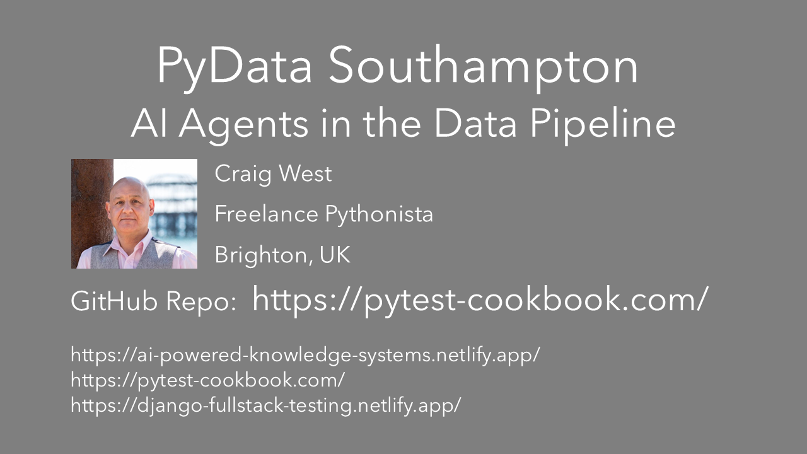

# EARL 2025 - Craig West

## AI Agents in the Data Pipeline

Code examples will be able to use either Groq or OpenAI except a few which are for demo purposes only.

You will need an LLM API key.

Groq offers a free tier and uses the same API signature as OpenAI.

A few demos will use Anthropic's Claude API. You won't need an API key for Claude for the workshop but you will need to run it on your own machine. At this current time Claude is not available as a free tier but you will not have to pay money upfront of say $5 as with OpenAI.

Free Tier with Groq: https://console.groq.com/login

## Set Up

Create a virtual environment and install requirements:

To run LLMs, copy .env.sample to .env and add your OpenAI key or Groq API key:

- OPENAI_API_KEY=sk-proj-TQa...
- GROQ_API_KEY=gsk_ow4T...

