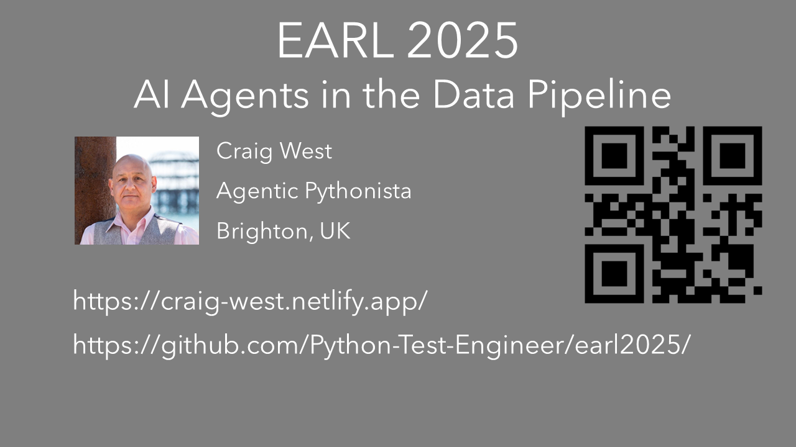

# EARL 2025 - Craig West

## AI Agents in the Data Pipeline

<<<<<<< HEAD

=======
>>>>>>> d45aeeb06b311e09a7cb2b1c0d0c368588f0c98d
Code examples will be able to use either Groq or OpenAI except a few which are for demo purposes only.

You will need an LLM API key.

Groq offers a free tier and uses the same API signature as OpenAI.

Free Tier with Groq: https://console.groq.com/login

## Set Up

Install requirements using either `pip install -r requirements.txt` or `uv sync`

To run LLMs, copy .env.sample to .env and add your OpenAI key or Groq API key:

- OPENAI_API_KEY=sk-proj-TQa...
- GROQ_API_KEY=gsk_ow4T...

## BrightonPy

Here is a recording of a talk I gave to BrightonPy Feb2025 where I go though many of the starter files in this repo about 'AI as API' and AI Agents

## [https://www.youtube.com/watch?v=irjDr747rls](https://www.youtube.com/watch?v=irjDr747rls)

## PyData Workshop

Here is a link to the repo for:

## [https://github.com/Python-Test-Engineer/pydata-southampton](https://github.com/Python-Test-Engineer/pydata-southampton)

